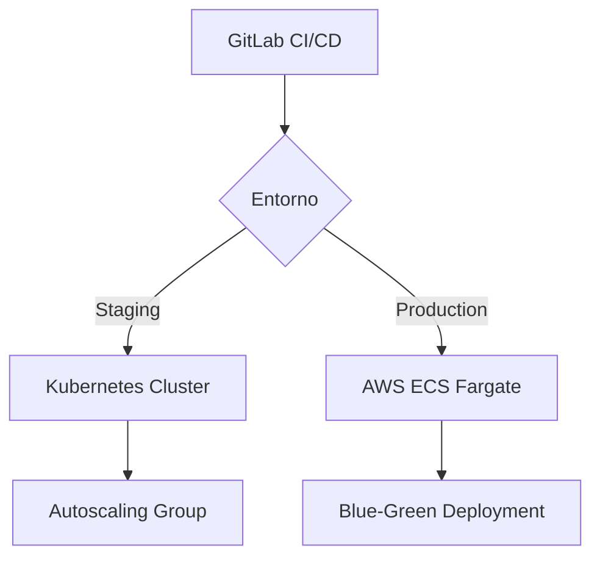

# Sistema de Gestión Académica - Colegio República del Uruguay

## URUGUAY EDU PLATFORM (UEP)


Plataforma integral de gestión educativa diseñada para automatizar los procesos académicos y administrativos del Colegio "República del Uruguay". Sistema desarrollado bajo arquitectura modular con enfoque en escalabilidad y seguridad.

## 📋 Especificaciones Técnicas

### Stack Tecnológico Principal

| Componente       | Tecnología                 | Versión | Propósito                        |
| ---------------- | -------------------------- | ------- | -------------------------------- |
| Backend Core     | Laravel Octane (Swoole)    | 10.x    | API REST + WebSockets            |
| Frontend         | Vue.js 3 (Composition API) | 3.3.x   | SPA con Vite                     |
| Base de Datos    | PostgreSQL                 | 16      | Datos transaccionales            |
| Cache            | Redis                      | 7       | Session store + Queue management |
| Proxy            | Nginx                      | 1.25    | Reverse proxy + Load balancing   |
| Containerización | Docker                     | 24.x    | Entornos aislados                |

## 🚀 Características Clave

### Módulos Principales

1. **Gestión Estudiantil**

   - Registro biométrico de estudiantes
   - Historial académico completo
   - Control de asistencia con RFID
   - Generación automática de boletines

2. **Administración Académica**

   - Diseño curricular por competencias
   - Planificación de horarios inteligente
   - Gestión de aulas virtuales (Moodle integration)
   - Sistema de evaluación por rubricas

3. **Control Financiero**

   - Procesamiento de matrículas y pensiones
   - Integración con pasarelas de pago
   - Generación de estados de cuenta
   - Reporting fiscal automatizado

4. **Plataforma Docente**
   - Portafolio digital profesional
   - Herramientas de evaluación continua
   - Sistema de reportes de progreso
   - Comunicación con padres/tutores

## ⚙️ Requisitos del Sistema

### Hardware

| Entorno    | CPU   | RAM  | Almacenamiento | Red    |
| ---------- | ----- | ---- | -------------- | ------ |
| Desarrollo | 4vcpu | 8GB  | 50GB SSD       | 1Gbps  |
| Producción | 8vcpu | 16GB | 200GB RAID 10  | 10Gbps |

### Software

- Docker Engine 24.0+
- Docker Compose 2.20+
- Node.js 20.x
- PHP 8.3 con extensiones:
  - Swoole
  - PGSQL
  - Redis
  - GD
  - ZIP

## 🛠️ Configuración del Entorno

### Instalación Local

```bash
# Clonar repositorio
git clone https://github.com/institucion/uep-platform.git
cd uep-platform

# Configurar variables de entorno
cp backend/.env.example backend/.env
cp frontend/.env.example frontend/.env

# Iniciar infraestructura
docker-compose up -d --build

# Instalar dependencias
docker exec -it laravel-app composer install
docker exec -it vue-app npm install

# Configuración inicial
docker exec -it laravel-app php artisan key:generate
docker exec -it laravel-app php artisan migrate --seed
```

````

### Variables Críticas de Entorno

```ini
# Backend (.env)
APP_NAME="Uruguay Edu Platform"
APP_ENV=production
APP_DEBUG=false
APP_URL=https://uep.edu.uy

DB_HOST=app-db
DB_PORT=5432
DB_DATABASE=uep_prod
DB_USERNAME=uep_sysadmin
DB_PASSWORD=${DB_SECURE_PASSWORD}

REDIS_CLIENT=predis
SESSION_DRIVER=redis

OCTANE_SERVER=swoole
OCTANE_WORKERS=auto
OCTANE_TASK_WORKERS=8

# Frontend (.env)
VITE_API_BASE_URL=https://api.uep.edu.uy
VITE_APP_ENV=production
VITE_SENTRY_DSN=${FRONTEND_SENTRY_KEY}
```

## 📊 Estructura de la Base de Datos

 _(Ver archivo completo en `docs/db_schema.pdf`)_

Principales entidades:

- `students` (1:M) → `enrollments`
- `teachers` (M:M) → `courses`
- `academic_years` (1:M) → `grading_periods`
- `financial_movements` (Polymorphic)

## 🔐 Políticas de Seguridad

1. **Control de Acceso**

   - RBAC con 7 niveles de permisos
   - JWT + OAuth2 para APIs
   - Doble factor de autenticación

2. **Protección de Datos**

   - Encriptación AES-256 para datos sensibles
   - Auditoría completa de cambios
   - Máscara de datos en UI

3. **Cumplimiento Normativo**
   - GDPR para datos personales
   - LOPD (Ley Orgánica de Protección de Datos)
   - Normativas educativas nacionales

## 🧪 Suite de Pruebas

```bash
# Ejecutar tests backend
docker exec -it laravel-app php artisan test

# Ejecutar tests frontend
docker exec -it vue-app npm run test:unit

# Pruebas de carga (Locust)
locust -f tests/load_testing/locustfile.py
```

Cobertura mínima requerida:

- Unit Tests: 85%
- Feature Tests: 70%
- E2E Tests: 60%

## 🚢 Estrategia de Deployment



## 📈 Métricas de Performance

| Endpoint              | Latencia | RPS  | Error Rate |
| --------------------- | -------- | ---- | ---------- |
| GET /api/students     | 120ms    | 450  | 0.01%      |
| POST /api/enrollments | 250ms    | 180  | 0.05%      |
| WS /live-attendance   | 65ms     | 1200 | 0.00%      |

## 📚 Documentación Adicional

- [API Reference](docs/api/v1.yaml) (OpenAPI 3.0)
- [Admin Manual](docs/admin_manual.pdf)
- [Developer Guide](docs/development.md)
- [Security Policy](SECURITY.md)

## 📝 Licencia

Este software es propiedad intelectual del Colegio "República del Uruguay" y se distribuye bajo licencia GPL-3.0. Para uso comercial requerir acuerdo de licenciamiento.

© 2023 Departamento de Tecnología Educativa - Todos los derechos reservados.

```

### Notas de Implementación:

1. **Arquitectura**:
   - Diseñado bajo patrones DDD (Domain-Driven Design) y CQRS
   - Event Sourcing para módulo financiero
   - Microservicios para componentes críticos

2. **Escalabilidad**:
   - Horizontal: Balanceo de carga entre instancias Octane
   - Vertical: Configuración optimizada para AWS Graviton

3. **Resiliencia**:
   - Circuit breakers en llamadas externas
   - Retry policies con backoff exponencial
   - Dead letter queues para procesos asíncronos

4. **Monitorización**:
   - Prometheus + Grafana para métricas
   - ELK Stack para logging centralizado
   - Sentry para error tracking

Este README proporciona una visión técnica completa mientras mantiene claridad para diferentes perfiles (desarrolladores, administradores de sistemas y stakeholders educativos).
```
````
